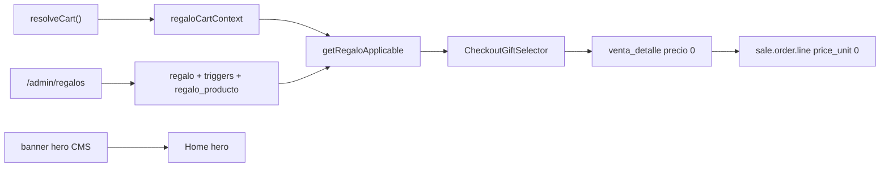

# Regalos por condición (admin + checkout + Odoo)

Documentación de la feature de **regalos** (obsequio al cumplir una condición de compra) para futuros cambios.

**Referencia live:** [oneclickstore.com](https://www.oneclickstore.com/) — hero “COMPRANDO DESDE $750.000…” + plugin Woo *Free Gifts* (reemplazado aquí por lógica nativa).  
**Última actualización:** 2026-08-31  
**Admin:** `/admin/regalos`

---

## 1. Qué hace

1. En admin se define una **regla de regalo**: nombre, **tipo de condición**, vigencia, lista de SKUs de obsequio.
2. En el **checkout**, si el carrito califica según el tipo de la regla activa y vigente, el cliente **debe elegir** uno de los SKUs de obsequio.
3. Al crear la venta se agrega un `venta_detalle` extra a **precio 0** (no suma a subtotal/total ni a ítems de Mercado Pago).
4. Al sincronizar con Odoo, la `sale.order` incluye una **línea de producto real** (`product_id` = `odoo_id` del SKU) con `price_unit = 0` y nombre con sufijo `(Regalo)`.
5. El **banner hero** de marketing ($750.000 / Ditoys) es CMS independiente (`/admin/banners`, `ubicacion=hero`); no está acoplado al monto de la regla.

---

## 2. Tipos de condición

| Tipo | Campo / tabla trigger | Cuándo califica |
|------|----------------------|-----------------|
| `monto` | `monto_minimo` | Subtotal del carrito ≥ umbral |
| `sku` | `regalo_trigger_producto` | El carrito contiene **al menos uno** de los SKUs trigger |
| `categoria` | `regalo_trigger_categoria` | El carrito contiene **al menos un producto** de alguna categoría trigger |

Los **SKUs de obsequio** (`regalo_producto`) son independientes del trigger: definen qué puede elegir el cliente cuando califica.

### Desempate

Si califican varias reglas a la vez:

1. Mayor `prioridad`
2. Entre tipo `monto`: mayor `monto_minimo`
3. Más reciente (`fecha_creacion` desc)

---

## 3. Modelo de datos

Definido en [`prisma/schema.prisma`](../prisma/schema.prisma).

### `regalo`

| Campo | Tipo | Uso |
|-------|------|-----|
| `id_regalo` | PK | |
| `nombre` | string | Label admin / copy checkout |
| `tipo` | `RegaloTipo` | `monto` \| `sku` \| `categoria` |
| `prioridad` | int | Desempate entre reglas |
| `monto_minimo` | Decimal? | Umbral (solo tipo `monto`) |
| `vigencia_desde` / `vigencia_hasta` | DateTime | `hasta` null = sin fin |
| `activo` | bool | |
| `fecha_creacion` | DateTime | Auditoría |
| `id_usuario_creacion` | FK → `usuario` | Admin que creó la regla |
| `fecha_modif` | DateTime | `@updatedAt` |

### `regalo_producto`

M2M `(id_regalo, id_producto)`. SKUs que el cliente puede elegir como obsequio.

### `regalo_trigger_producto`

M2M `(id_regalo, id_producto)`. SKUs del carrito que desbloquean el regalo (tipo `sku`).

### `regalo_trigger_categoria`

M2M `(id_regalo, id_categoria)`. Categorías cuyos productos en el carrito desbloquean el regalo (tipo `categoria`).

### Resolución en runtime

[`getRegaloApplicable(cart)`](../src/lib/regalos.ts) recibe `{ subtotal, productIds }` (ítems disponibles del carrito):

1. Filtrar `activo` + vigente + al menos un producto de obsequio asociado.
2. Evaluar condición según `tipo`.
3. Aplicar desempate (`prioridad`, `monto_minimo` si aplica, `fecha_creacion`).

Helper: `regaloCartContext(cart)` desde [`src/lib/cart.ts`](../src/lib/cart.ts).

### Migración / seed

- Schema: `npx prisma db push` (o migrate) + `npx prisma generate`.
- Reglas existentes quedan con `tipo = monto` (default enum).
- No hay seed de reglas de regalo: se cargan en admin.

---

## 4. Archivos clave

| Rol | Path |
|-----|------|
| Queries / validación selección | [`src/lib/regalos.ts`](../src/lib/regalos.ts) |
| Alta venta + línea $0 + stock | [`src/lib/checkout-venta.ts`](../src/lib/checkout-venta.ts) |
| Línea Odoo `price_unit=0` | [`src/lib/odoo-venta.ts`](../src/lib/odoo-venta.ts) (`createOdooSaleOrder`) |
| UI selector checkout | [`src/components/checkout-gift-selector.tsx`](../src/components/checkout-gift-selector.tsx) |
| Página checkout | [`src/app/(shop)/checkout/page.tsx`](../src/app/(shop)/checkout/page.tsx) |
| Admin listado / nuevo / detalle | [`src/app/admin/regalos/`](../src/app/admin/regalos/) |
| Server Actions | [`src/app/admin/regalos/actions.ts`](../src/app/admin/regalos/actions.ts) |
| Campos tipo (admin) | [`src/components/admin/regalo-tipo-fields.tsx`](../src/components/admin/regalo-tipo-fields.tsx) |
| Prueba E2E Odoo | [`scripts/test-checkout-odoo.ts`](../scripts/test-checkout-odoo.ts) `--regalo` |

---

## 5. Flujo



### Checkout

1. `getRegaloApplicable(regaloCartContext(cart))` → si hay regla, render `CheckoutGiftSelector`.
2. Radios `name="id_producto_regalo"` (HTML `required` + `form.reportValidity` en pago tarjeta).
3. Server: `resolveSelectedRegaloProducto(cart, id)` — exige selección válida si aplica.
4. `venta_detalle`: `precio_unitario = 0`, `precio_cobrado = 0`, `nombre_producto` con `(Regalo)`.
5. Stock local + Odoo del SKU regalo (mismo almacén que el pedido).
6. `itemsCobro` / preferencia MP **excluyen** líneas a $0.

### Odoo

En el loop de `venta.detalles`:

- Si `precio_cobrado ≈ 0` → `price_unit = 0`, nombre con `(Regalo)`.
- Es producto real → entra al picking/stock como el resto.

---

## 6. Admin

| Acción | Ruta |
|--------|------|
| Listado | `/admin/regalos` |
| Alta | `/admin/regalos/nuevo` |
| Edición + triggers + SKUs obsequio | `/admin/regalos/[id]` |

Campos editables: nombre, tipo, prioridad, monto mínimo (solo tipo monto), vigencia, activo.

Por tipo en detalle:

- **monto:** solo monto mínimo en la regla.
- **sku:** card “SKUs que desbloquean el regalo” (`regalo_trigger_producto`).
- **categoria:** card con checkboxes de categorías trigger.

Card “SKUs de regalo”: productos que el cliente elige en checkout (todos los tipos).

---

## 7. Pruebas

```bash
# Venta retiro con línea de regalo a $0 en Odoo
npm run test:checkout-odoo -- --regalo

# Envío + regalo
npm run test:checkout-odoo -- --envio --regalo
```

El flag `--regalo` crea/usa una regla `tipo = monto` con el SKU de obsequio asociado.

---

## 8. Checklist al modificar

1. ¿Nueva campaña? → Admin Regalos con el tipo correcto; actualizar copy del hero en Banners si hace falta.
2. ¿SKU nuevo de obsequio? → Asociarlo en “SKUs de regalo”; debe tener `odoo_id` + stock.
3. ¿Regla por SKU/categoría? → Configurar triggers en admin; probar checkout con carrito que califique.
4. ¿Cambio en evaluación? → Mantener `getRegaloApplicable` y `resolveSelectedRegaloProducto` en sync (SSR + submit).
5. Probar: `npm run test:checkout-odoo -- --regalo` y revisar `OCWN-<id>` en Odoo.

---

## 9. Fuera de alcance

- Barra de progreso de regalo en el drawer del carrito.
- Acoplar el monto del banner hero al `monto_minimo` de la regla.
- Herencia de categorías padre en triggers (evaluación directa vía `categoria_producto`).
